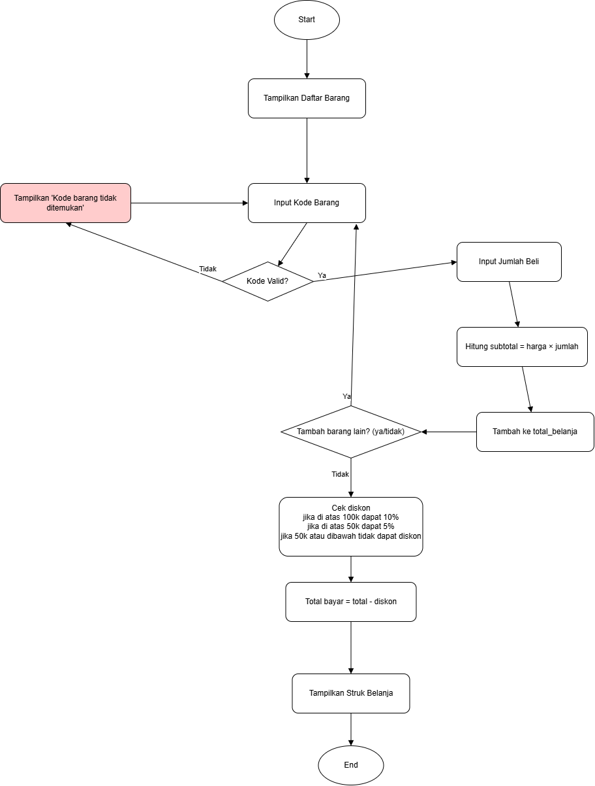

# UTS Algoritma - Kasir Sederhana dengan Python

## Deskripsi

Program ini dibuat sebagai tugas **Ujian Tengah Semester (UTS)** mata kuliah **Algoritma dan Pemrograman** pada program studi **Rekayasa Perangkat Lunak (RPL)**.

## Flowchart Program Kasir




Aplikasi ini merupakan sistem **kasir sederhana** untuk toko kelontong milik **Taro Sakamoto**, mantan pembunuh bayaran legendaris yang kini menjalankan usaha kecil. Program dibuat menggunakan bahasa pemrograman **Python**.

## Fitur Program

- Menampilkan daftar barang toko beserta kode dan harga
- Memungkinkan pengguna memilih barang berdasarkan **kode**
- Input jumlah barang yang ingin dibeli
- Menghitung total harga per barang dan keseluruhan
- Menambahkan lebih dari satu barang dalam satu transaksi
- Memberikan diskon:
  - **10%** jika total belanja > Rp100.000
  - **5%** jika total belanja > Rp50.000 dan ≤ Rp100.000
  - **Tanpa diskon** jika ≤ Rp50.000
- Menampilkan rincian akhir belanja (total, diskon, dan total bayar)

## Daftar Barang

| Kode | Nama Barang        | Harga (Rp) |
|------|--------------------|------------|
| A1   | Beras/1kg          | 11.000     |
| B2   | Minyak Goreng/1L   | 20.000     |
| C3   | Indomie            | 4.000      |
| D4   | Telur (1 kg)       | 32.000     |
| E5   | Terigu             | 20.000     |
| F6   | Kopi Sachet        | 2.000      |

## Cara Menjalankan

1. Pastikan Python sudah terinstal di perangkat kamu
2. Clone repository ini:
   ```bash
   git clone https://github.com/Wanzzy1/UTS-Algoritma-Kasir-sederhana-dengan-python.git
